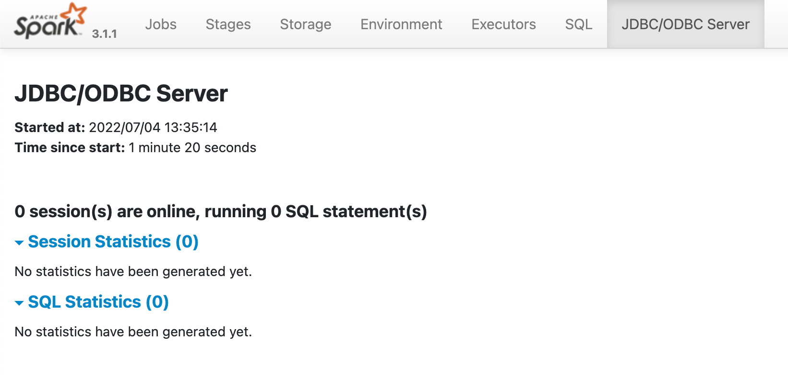

# Day 3: sbt-spark plugin

## dbt init

It appears that the entry point to dbt is [dbt init](https://docs.getdbt.com/reference/commands/init) (not a directory with some random files that I created initially and have been using so far):

> `dbt init` helps get you started using dbt Core!

Let's find out what happens to my existing `dbt-sandbox` project.

```console
$ dbt init
Setting up your profile.
The profile postgres_at_my_company already exists in /Users/jacek/.dbt/profiles.yml. Continue and overwrite it? [y/N]: N
```

Let's find out what happens when `dbt init` from some random directory.

```console
$ dbt init
Enter a name for your project (letters, digits, underscore): hello_dbt
Which database would you like to use?
[1] databricks
[2] spark

(Don't see the one you want? https://docs.getdbt.com/docs/available-adapters)

Enter a number:
```

Ouch, I forgot to use `pyenv virtualenv dbt` to set up a virtual environment with the plugin adapters.

Let's start over (remembering the steps from [Day 1: Installing dbt](./001.md)).

```console
$ pyenv shell dbt

$ pip list dbt | egrep "^dbt-" | sort
dbt-core                 1.1.1
dbt-databricks           1.1.0
dbt-extractor            0.4.1
dbt-postgres             1.1.1
dbt-spark                1.1.0

$ dbt init
Enter a name for your project (letters, digits, underscore): hello_dbt
Which database would you like to use?
[1] databricks
[2] postgres
[3] spark

(Don't see the one you want? https://docs.getdbt.com/docs/available-adapters)

Enter a number: 3
host (yourorg.sparkhost.com): localhost
[1] odbc
[2] http
[3] thrift
Desired authentication method option (enter a number): 2
token (abc123): abc123
connect_timeout [10]:
connect_retries [0]:
port [443]:
schema (default schema that dbt will build objects in): my_schema
threads (1 or more) [1]:
Profile hello_dbt written to /Users/jacek/.dbt/profiles.yml using target's profile_template.yml and your supplied values. Run 'dbt debug' to validate the connection.
Your new dbt project "hello_dbt" was created!

For more information on how to configure the profiles.yml file,
please consult the dbt documentation here:

  https://docs.getdbt.com/docs/configure-your-profile

One more thing:

Need help? Don't hesitate to reach out to us via GitHub issues or on Slack:

  https://community.getdbt.com/

Happy modeling!

$ tree hello_dbt
hello_dbt
├── README.md
├── analyses
├── dbt_project.yml
├── macros
├── models
│   └── example
│       ├── my_first_dbt_model.sql
│       ├── my_second_dbt_model.sql
│       └── schema.yml
├── seeds
├── snapshots
└── tests

7 directories, 5 files
```

The most important take away is the following message:

> Profile hello_dbt written to /Users/jacek/.dbt/profiles.yml using target's profile_template.yml and your supplied values. Run 'dbt debug' to validate the connection.

We learnt `dbt debug` the other day already!

```console
$ cd hello_dbt

$ dbt debug
dbt version: 1.1.1
python version: 3.9.13
python path: /Users/jacek/.pyenv/versions/dbt/bin/python3.9
os info: macOS-11.6.6-x86_64-i386-64bit
Using profiles.yml file at /Users/jacek/.dbt/profiles.yml
Using dbt_project.yml file at /private/tmp/hello_dbt/dbt_project.yml

Configuration:
  profiles.yml file [ERROR invalid]
  dbt_project.yml file [OK found and valid]

Required dependencies:
 - git [OK found]

1 check failed:
Profile loading failed for the following reason:
Runtime Error
  Credentials in profile "hello_dbt", target "dev" invalid: Runtime Error
    http connection method requires additional dependencies.
    Install the additional required dependencies with `pip install dbt-spark[PyHive]`
```

I had to quote `dbt-spark[PyHive]` to get it working on my macOS on oh-my-zsh. _Wonder what shells would unquoted square brackets work?!_

```console
$ pip install "dbt-spark[PyHive]"
...
Successfully installed PyHive-0.6.5 pure-sasl-0.6.2 sasl-0.3.1 thrift-0.15.0 thrift_sasl-0.4.3

$ dbt debug
dbt version: 1.1.1
python version: 3.9.13
python path: /Users/jacek/.pyenv/versions/dbt/bin/python3.9
os info: macOS-11.6.6-x86_64-i386-64bit
Using profiles.yml file at /Users/jacek/.dbt/profiles.yml
Using dbt_project.yml file at /private/tmp/hello_dbt/dbt_project.yml

Configuration:
  profiles.yml file [OK found and valid]
  dbt_project.yml file [OK found and valid]

Required dependencies:
 - git [OK found]

Connection:
  host: localhost
  port: 443
  cluster: None
  endpoint: None
  schema: my_schema
  organization: 0
  Connection test: [ERROR]

1 check failed:
dbt was unable to connect to the specified database.
The database returned the following error:

  >Runtime Error
  Database Error
    failed to connect

Check your database credentials and try again. For more information, visit:
https://docs.getdbt.com/docs/configure-your-profile
```

## dbt-spark

[dbt-spark](https://github.com/dbt-labs/dbt-spark)

```console
$ dbt --version
Core:
  - installed: 1.1.1
  - latest:    1.1.1 - Up to date!

Plugins:
  - databricks: 1.1.0 - Up to date!
  - postgres:   1.1.1 - Up to date!
  - spark:      1.1.0 - Up to date!
```

Following the official [Getting started](https://github.com/dbt-labs/dbt-spark#getting-started).

```console
$ git clone https://github.com/dbt-labs/dbt-spark.git

$ cd dbt-spark

$ docker-compose up
...
dbt-spark-dbt-spark3-thrift-1   | 22/07/04 13:35:18 INFO HiveThriftServer2: HiveThriftServer2 started
```

<http://localhost:4040/sqlserver/> should work fine.



```console
$ dbt init
Setting up your profile.
The profile hello_dbt already exists in /Users/jacek/.dbt/profiles.yml. Continue and overwrite it? [y/N]: y
Which database would you like to use?
[1] databricks
[2] postgres
[3] spark

(Don't see the one you want? https://docs.getdbt.com/docs/available-adapters)

Enter a number: 3
host (yourorg.sparkhost.com): localhost
[1] odbc
[2] http
[3] thrift
Desired authentication method option (enter a number): 3
port [443]: 10000
schema (default schema that dbt will build objects in): analytics
threads (1 or more) [1]:
Profile hello_dbt written to /Users/jacek/.dbt/profiles.yml using target's profile_template.yml and your supplied values. Run 'dbt debug' to validate the connection.

$ dbt debug
13:42:50  Running with dbt=1.1.1
dbt version: 1.1.1
python version: 3.9.13
python path: /Users/jacek/.pyenv/versions/dbt/bin/python3.9
os info: macOS-11.6.6-x86_64-i386-64bit
Using profiles.yml file at /Users/jacek/.dbt/profiles.yml
Using dbt_project.yml file at /private/tmp/hello_dbt/dbt_project.yml

Configuration:
  profiles.yml file [OK found and valid]
  dbt_project.yml file [OK found and valid]

Required dependencies:
 - git [OK found]

Connection:
  host: localhost
  port: 10000
  cluster: None
  endpoint: None
  schema: analytics
  organization: 0
  Connection test: [OK connection ok]

All checks passed!
```

Yay! dbt on Spark finally! That concludes Day 3.
