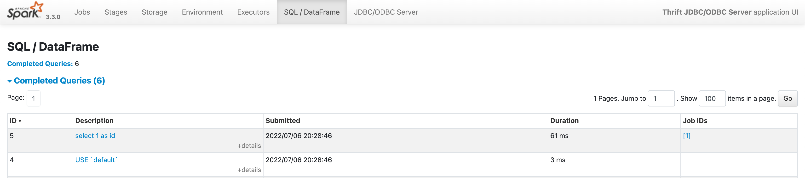

# Day 4: Spark Thrift Server (and dbt debug)

It turns out that I used a fake dbt project (`/tmp/hello_dbt`) with `pyenv shell dbt` the other day. It has to be fixed some day.

Before it happens, I couldn't wait to have a look at [Spark Thrift Server](https://spark.apache.org/docs/latest/sql-distributed-sql-engine.html) that I completely forgot about.

This is what [dbt-spark](https://github.com/dbt-labs/dbt-spark) project uses in [docker-compose.yml](https://github.com/dbt-labs/dbt-spark/blob/main/docker-compose.yml).

## Running Spark Thrift Server

Unless I'm missing something, there's no reason why they keep using Apache Spark 3.1.1 (as I learnt on [Day 3](./003.md#dbt-spark)). The latest and greatest 3.3.0 works just fine.

``` shell-session
$ ./bin/spark-submit --version
Welcome to
      ____              __
     / __/__  ___ _____/ /__
    _\ \/ _ \/ _ `/ __/  '_/
   /___/ .__/\_,_/_/ /_/\_\   version 3.3.0
      /_/

Using Scala version 2.12.15, OpenJDK 64-Bit Server VM, 11.0.15
Branch heads/v3.3.0
Compiled by user jacek on 2022-06-17T18:35:32Z
Revision f74867bddfbcdd4d08076db36851e88b15e66556
Url https://github.com/apache/spark.git
Type --help for more information.
```

Let's start Spark Thrift Server.

``` shell
./sbin/start-thriftserver.sh
```

Observe the logs in `logs` directory.

``` shell-session
$ tail -f logs/spark-jacek-org.apache.spark.sql.hive.thriftserver.HiveThriftServer2*.out
...
INFO ThriftCLIService: Starting ThriftBinaryCLIService on port 10000 with 5...500 worker threads
INFO AbstractService: Service:HiveServer2 is started.
INFO HiveThriftServer2: HiveThriftServer2 started
```

Use <http://localhost:4040/sqlserver/> to monitor queries.

``` shell-session
$ pwd
/tmp/hello_dbt

$ dbt debug
dbt version: 1.1.1
python version: 3.9.13
python path: /Users/jacek/.pyenv/versions/dbt/bin/python3.9
os info: macOS-11.6.6-x86_64-i386-64bit
Using profiles.yml file at /Users/jacek/.dbt/profiles.yml
Using dbt_project.yml file at /private/tmp/hello_dbt/dbt_project.yml

Configuration:
  profiles.yml file [OK found and valid]
  dbt_project.yml file [OK found and valid]

Required dependencies:
 - git [OK found]

Connection:
  host: localhost
  port: 10000
  cluster: None
  endpoint: None
  schema: analytics
  organization: 0
  Connection test: [OK connection ok]

All checks passed!
```

With that, you can use whatever Spark version you want and skip [docker-compose.yml](https://github.com/dbt-labs/dbt-spark/blob/main/docker-compose.yml).

The following shows the queries that `dbt debug` uses to check connection.



There are the following two queries:

```sql
USE `default`
```

```sql
select 1 as id
```
